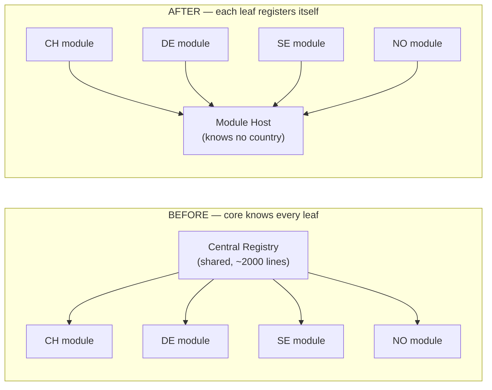
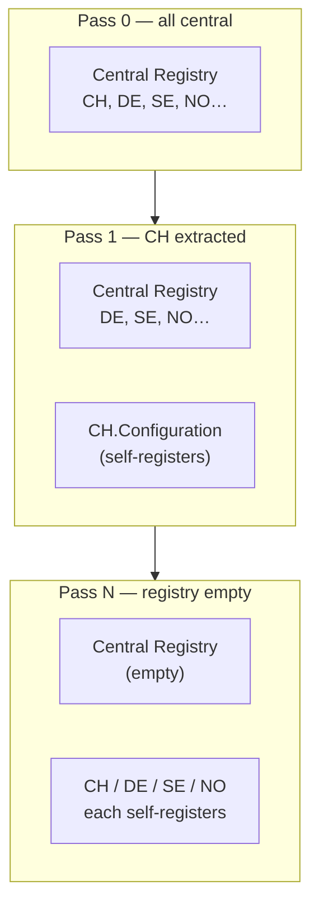
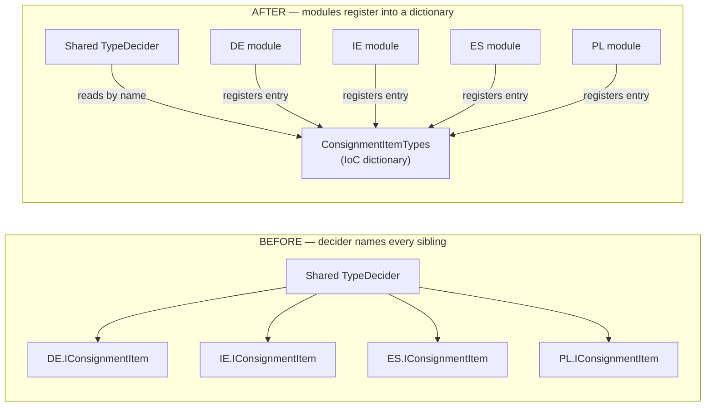

# Modular Monolith — Blog + Interview Prep Handoff

> Portable working doc. Contains: (1) work-item evidence, (2) two flagship architecture
> stories with real before/after code, (3) full blog Part 1 draft, (4) Part 2 outline,
> (5) next steps. Move/copy this anywhere to continue on another machine.
>
> NOTE: Section 1–2 reference internal WI numbers and class names for YOUR private use.
> The blog sections (3–4) are already genericized for public publishing.

---

## 0. Context / who

- **Author:** Tony Tran (staff code `TT7`), Senior Software Engineer, CargoWise Customs.
- **Boards:** Customs Vietnam, Customs Universal Architecture.
- **Two bodies of work:**
  - VN Customs EDI messaging / PDF printout feature delivery (VAE800, VAE1LD/2LD/3LD,
    VAE2LE/3LE, VAL802, VAExRD, etc.) — depth in a regulated domain.
  - **Modular Monolith (ModMono)** — architecture/platform program (focus of this doc).

---

## 1. ModMono — work-item evidence

**Program:** `PRJ00055009 — Configure Customs into ModMono Submodules`, under parent
`WI01012551 — CW ModMono`. NCN diagram: *"CW ModMono"* + *"Configure Customs into ModMono
Submodules"* (~90 work items: tooling, per-country extraction, decoupling).

**Goal:** Decompose a large C# monolith into independently-buildable **git submodules** —
same single deployable, but modular build/test/ownership with enforced boundaries.

### My contribution spanned three layers

| Layer | Work items | Role |
|---|---|---|
| Country submodule extraction | `WI01037103` (CN), `WI01035891` (IL) | Contributor |
| Module registration decoupling (`IModuleListingSubset`) | `WI00957225` (CH), `WI00957228` (AE) | **Sole author (CH)** |
| TypeDecider → Spring dictionary | `WI01021530`, `WI01021435` (EU) | Co-author |

Supporting/sibling decoupling work in the same initiative:
`WI01042937` (RegistryItemSetsConfiguration decouple), `WI01034660`
(JobDeclarationBusinessObjectFactory Spring dict), `WI01024675`
(ModuleListingSubset backed by Spring dictionaries).

Tooling in the program: `SubmoduleAnalyzer` (scans ObjectFactory/Spring configs +
reflection refs → "Invalid Reference Count: 0 = safe to extract"), ProjectGraph
reflection analyzer, per-submodule build/test support.

---

## 2. Two flagship stories (with real before/after code)

### Story A — CH `IModuleListingSubset` (WI00957225) — SOLE AUTHOR

Commit `aa79f754509d` (author: Tony Tran), 60 files, +399/-187.
Branch `TT7/WI00957225/CH_IModuleListingSubset`.

**Problem:** CH module/controller/security-checkpoint registrations lived in central
shared files (`ModuleRegistration.cs` ~2000 lines, `ControllerRegistration.cs`,
`SecurityCore.cs`) — a hard dependency blocking CH from becoming an independent submodule.

**Removed** all CH entries from the central shared files, e.g.:

```csharp
// DELETED from central ControllerRegistration.cs
Add(new ControllerInfo(ControllerIDs.Customs.JobDeclaration, "Enterprise.Customs.CH.Module", "...JobDeclarationController", CountryCodes.Switzerland));
Add(new ControllerInfo(ControllerIDs.Customs.CH.DeclarationActivation, "Enterprise.Customs.CH.DeclarationActivation.Module", "...", CountryCodes.Switzerland));
// + CH nested ControllerID/ModuleID classes, + CH security checkpoints from SecurityCore.cs
```

**Added** a new self-contained `Enterprise.Customs.CH.Configuration` project owning CH's
own registration via `CHModuleListingSubset : BaseModuleListingSubset`:

```csharp
public class CHModuleListingSubset : BaseModuleListingSubset
{
    public override void InitializeModuleTree(ModuleTreeCategories cats, IZSecurity security)
    {
        var customsMain = cats.Operate.Sections[ModuleTreeLoaderConstant.Section.CustomsMain.Name];
        ModuleTreeLoaderHelpers.AddModule(customsMain, CHModuleIDs.CustomsSummary);
        ModuleTreeLoaderHelpers.AddModuleIf(
            CurrentCountry == Constants.CountryCodes.Switzerland &&
            (bool)ObjectFactory.Get<ICHCustomsRegistry>().DeclarationActivationEnabled.Value,
            customsMain, CHModuleIDs.DeclarationActivation);   // registry-driven conditional load
    }

    public override IEnumerable<ModuleInfo> ModuleInfos => [ /* CH declares its own modules */ ];
    public override IEnumerable<ControllerInfo> ControllerInfos => [ /* ...its own controllers */ ];
    public override void InitializeSecurityCheckpoints(IZSecurity security) { /* ...own checkpoints */ }

    protected override string CountryCode  => Constants.CountryCodes.Switzerland;
    protected override string AssemblyName => "Enterprise.Customs.CH.Module";
}
```

Also introduced CH-owned `CHModuleIDs`/`CHControllerIDs`/`CHSecurityCheckpoints`, moved
`AssemblyInfo` + `CHEnterpriseApplicationConfiguration.xml`, added
`CHModuleListingSubsetTest.cs` (94 lines) proving CH loads standalone.

**Craftsmanship (from commit messages):** incremental migration — Register → Move Module
info → Move ControllerIDs → Move security checkpoints → Load module based on registry
value → Fix failed reflection test → Fix ApplicationStartupDirectorTest → Fix NCTS /
DeclarationActivation build errors. Not a big-bang.

### Story B — TypeDecider → Spring dictionary (WI01021530) — CO-AUTHOR

Commit `b0eb73218300` (co-authored-by Tony Tran), 18 files, +108/-83.

**BEFORE** — shared decider references every sibling country at compile time:

```csharp
public class CusExitConsignmentItemTypeDecider : CountrySpecificTypeDecider
{
    protected override IEnumerable<CountrySpecificType> CountrySpecificTypesCore => new[]
    {
        new CountrySpecificType(CountryCodes.Germany, ObjectFactory.GetType<DEExitControl.ICusExitConsignmentItem>),
        new CountrySpecificType(CountryCodes.Ireland, ObjectFactory.GetType<IEExitControl.ICusExitConsignmentItem>),
        new CountrySpecificType(CountryCodes.Spain,   ObjectFactory.GetType<ESExitControl.ICusExitConsignmentItem>),
        new CountrySpecificType(CountryCodes.Poland,  ObjectFactory.GetType<PLExitControl.ICusExitConsignmentItem>),
    };
    protected override Type DefaultTypeForEuCountry => ObjectFactory.GetType<EUExitControl.ICusExitConsignmentItem>();
    protected override Type DefaultTypeForUnsupportedCountry => typeof(CusExitConsignmentItem);
}
```

**AFTER** — country map moved to a Spring dictionary; class references no siblings:

```csharp
public class CusExitConsignmentItemTypeDecider() : CountrySpecificConfigurationTypeDecider(DictionaryName)
{
    public const string DictionaryName = "CusExitConsignmentItemTypes";

    protected override ZString GetCountryCodeFromRow(DataRow row, BusinessObjectFactory factory)
    {
        var consignmentPK = row != null ? new ZGuid(row[AutoCusExitConsignmentItem.Schema.CCI_CXC_Consignment]) : ZGuid.Invalid;
        var consignment = factory.Load<CusExitConsignment>(consignmentPK);
        return consignment?.Header?.CountryCode ?? GetCurrentCountryCode();
    }

    protected override Type DefaultType => typeof(CusExitConsignmentItem);
}
```

Country→type bindings moved into per-country Spring XML
(`DE/ES/IE/PL/EUEnterpriseApplicationConfiguration.xml`). Tests rewritten to inherit
`CountrySpecificConfigurationTypeDeciderTest` and **substitute a dummy dictionary in
ObjectFactory** — no test references a concrete country.

### Interview soundbite (combined)

> "I worked on a modular-monolith initiative decomposing a large freight platform into
> independently-buildable submodules. My part spanned three layers: extracting country
> Customs modules into git submodules (CN, IL); giving each country its own
> self-registering module subset + Configuration project instead of a central 2000-line
> registry (CH — sole author); and refactoring shared TypeDeciders from hard-coded
> country references to Spring.NET dictionary-based dependency injection so a module
> resolves types from config at runtime instead of referencing siblings at compile time.
> I migrated incrementally with the monolith always shipping, chased the reflection and
> startup-integration tests the central registry had implicitly satisfied, and kept the
> tests decoupled by injecting mock dictionaries. The pattern rolled out across ~30
> countries."

---

## 3. Blog — Part 1 (FULL DRAFT, genericized, publish-ready)

*Part 1 of 2. Part 2 covers the two patterns that made it possible.*

### How We Started Splitting a Legacy Monolith Into Modules — and the Coupling That Fought Back

#### The setup

I work on a large enterprise platform — millions of lines of C#, two decades of history,
hundreds of projects, one deployable. It ships as a single monolith, and for a long time
that was fine. It stopped being fine when the *build* became the bottleneck: touch one
file, wait on a build-and-test cycle that dragged in the entire codebase, because
everything could, in principle, depend on everything.

We didn't want to blow it up into 200 microservices. We wanted something more modest and,
honestly, more useful for our situation: a **modular monolith**. Same deployable, but
internally split into modules that build, test, and are owned independently — with
*enforced* boundaries so they can't quietly re-entangle.

This post is about the part nobody warns you about: **you cannot extract a module until
you have severed every reference into and out of it — including the references your
compiler can't see.**

#### The naïve mental model (and why it's wrong)

The plan sounds trivial:

1. Pick a module (say, a country-specific feature area).
2. Move its projects into a submodule.
3. Done.

Here's the reality that greeted the first attempt. The module I wanted to extract looked
self-contained, but it was held in place by two kinds of coupling that don't show up until
you pull:

- **A central registry that every module writes into.** One shared file, thousands of
  lines, where *every* module registered its UI screens, controllers, and permissions.
  Extract a module and its registrations are still sitting in the shared file — which now
  won't compile without the module.
- **Hard-coded type resolution.** Shared "decider" classes that resolved a concrete
  implementation by explicitly listing every variant — one line per country, each
  referencing that country's assembly. Extract one country and the shared class has a
  dangling reference to it.

Neither of these is visible when you eyeball the module. Both are fatal to extraction.

#### Coupling type 1: the god-registry

Somewhere in the platform was a file conceptually like this:

```csharp
// ModuleRegistration.cs — shared by the ENTIRE monolith (~2000 lines)
public static class ModuleRegistration
{
    public void RegisterAll()
    {
        // ...hundreds of unrelated modules...

        // Country CH
        Add(new ModuleInfo(ModuleIDs.JobDeclaration,  "Customs.CH.Module", "...JobDeclarationModule",  CountryCodes.CH));
        Add(new ModuleInfo(ModuleIDs.CustomsSummary,  "Customs.CH.Module", "...CustomsSummaryModule",  CountryCodes.CH));
        Add(new ModuleInfo(ModuleIDs.Activation,      "Customs.CH.Activation.Module", "...", CountryCodes.CH));

        // Country NO, SE, DE, ... all jammed in the same file
    }
}
```

Every country's identity lived in a file owned by no one and edited by everyone. This is a
**god object** in registry form. As long as CH's registrations live here, the central
assembly has a hard dependency on CH — the exact opposite of what "CH is an independent
module" should mean.

The dependency arrow points the wrong way. The platform core knows about every leaf. To
extract a leaf, the arrow has to flip: **the module should register itself.**



Same boxes, arrows reversed. That reversal is the whole game: in *BEFORE* you can't remove
a leaf without breaking the core; in *AFTER* any leaf can leave without the host noticing.

#### Coupling type 2: the type-decider that names its siblings

The second pattern was subtler. A shared base class resolved a country-specific
implementation like this:

```csharp
// BEFORE — the shared decider references every sibling module at compile time
public class ConsignmentItemTypeDecider : CountrySpecificTypeDecider
{
    protected override IEnumerable<CountrySpecificType> CountrySpecificTypes => new[]
    {
        new CountrySpecificType(CountryCodes.DE, ObjectFactory.GetType<DE.IConsignmentItem>),
        new CountrySpecificType(CountryCodes.IE, ObjectFactory.GetType<IE.IConsignmentItem>),
        new CountrySpecificType(CountryCodes.ES, ObjectFactory.GetType<ES.IConsignmentItem>),
        new CountrySpecificType(CountryCodes.PL, ObjectFactory.GetType<PL.IConsignmentItem>),
    };
}
```

Read that closely. This one class — which lives in a *shared* location — has compile-time
references to `DE`, `IE`, `ES`, and `PL`. You cannot extract the DE module without breaking
this class. You cannot extract *any* of them independently, because they're all named right
here. The "shared" code is quietly a hub wired to every spoke.

#### The invisible one: reflection

The nastiest coupling wasn't compile-time at all. A lot of wiring happened through
**reflection and DI string lookups** — resolving a type by assembly-qualified name at
runtime. The compiler is blind to these. Your build goes green, your unit tests pass, and
then a module fails to load in a running system because a reflection string points at an
assembly that's no longer where it expects.

When we ran a dependency analyzer over one candidate module, the compile-time references
were clean — but it flagged hundreds of *unresolved reflection references* across the repo
that a naïve split would have silently broken. That was the moment the real scope of the
work became clear: **the compiler is not your source of truth for coupling.**

> **A war story.** My first extraction attempt looked like a total success. The solution
> compiled. The unit tests were green. I pushed it, feeling pretty good. Then the app came
> up and the module's screens simply… weren't there. No exception in my code, no compiler
> error — the module tree loaded, skipped the entries it couldn't resolve, and moved on.
> The culprit was a registration that resolved the module by an assembly-qualified *string*
> at startup; when I moved the assembly, the string still pointed at the old location and
> failed silently. I'd been treating "compiles + tests pass" as "safe to move." It isn't.
> That failure is why the third prerequisite below — a reference gate that understands
> reflection — exists at all. I got burned once so the next 29 extractions wouldn't be.

#### The reframe

After the first painful attempt, the mental model changed from "move files" to this:

> Extraction is the *last* step. The real work is inverting dependencies so the module
> stops being referenced by shared code — and proving, with tooling, that no hidden
> references remain.

Concretely, before a single project moved, each module needed:

1. **Self-registration.** The module declares its own screens, controllers, and permissions
   instead of a central file declaring them. (Dependency arrow flipped.)
2. **Configuration-driven type resolution.** Shared deciders resolve implementations from
   injected configuration, not a hard-coded list of siblings. (Compile-time sibling
   references gone.)
3. **A reference gate.** A static analyzer that scans compile-time *and* reflection/DI
   references and fails if a module reaches somewhere it shouldn't. (Invisible coupling
   made visible.)

Only after all three could the "boring" part — moving the projects into a submodule —
actually succeed.

#### What this bought us

Doing it this way, one module at a time, meant:

- **No big-bang rewrite.** The monolith kept shipping the entire time. Each module was
  migrated, verified, and merged independently.
- **The god-registry shrank on every pass.** Each extraction deleted that module's lines
  from the central file. The shared file went from "everyone's problem" toward empty.
- **Boundaries became enforceable.** With a reference gate in CI, a module can't silently
  re-couple itself to a sibling — the build fails.

#### What's next

The two patterns that made this possible are worth their own deep-dive:

- **Self-registering modules** — replacing a central registry with per-module registration,
  Strangler-Fig style.
- **DI-dictionary type resolution** — turning a hard-coded `switch` over variants into
  runtime configuration, including how to keep the *tests* decoupled too.

That's **Part 2**.

*If you've done a modular-monolith migration, I'd love to hear which coupling surprised you
most — for me it was reflection, every time.*

---

## 4. Blog — Part 2 (FULL DRAFT, genericized, publish-ready)

*Part 2 of 2. Part 1 covered the coupling that fought back. This part is the two patterns
that beat it — with as many concrete examples as I could fit.*

### Two Patterns That Made Our Modular-Monolith Split Possible

In Part 1 I described two kinds of coupling that block you from extracting a module: a
**central god-registry** every module writes into, and **shared "decider" classes that
name every sibling** at compile time. Here are the two patterns we used to kill them —
plus the tooling that proved a module was actually safe to move.

Everything below is genericized from a real migration. Names are neutral; the shapes are
exactly what we shipped.

---

### Pattern 1 — Self-registering modules (Strangler Fig, inside a monolith)

**The anti-pattern.** A single shared file registered every module's screens, controllers,
and permissions:

```csharp
// ModuleRegistration.cs — shared by the ENTIRE monolith (~2000 lines)
// Country CH block:
Add(new ModuleInfo(ModuleIDs.SingleTariffClassification, "Customs.CH.Module", "...CusClassificationModule",  CountryCodes.CH));
Add(new ModuleInfo(ModuleIDs.JobDeclaration,             "Customs.CH.Module", "...JobDeclarationModule",      CountryCodes.CH));
Add(new ModuleInfo(ModuleIDs.CH.CustomsSummary,          "Customs.CH.Module", "...CustomsSummaryModule",      CountryCodes.CH));
Add(new ModuleInfo(ModuleIDs.CH.DeclarationActivation,   "Customs.CH.Activation.Module", "...",               CountryCodes.CH));
// ...and the same again in ControllerRegistration.cs, and again for security checkpoints.
```

**The fix — a base class each module implements to register *itself*.** Introduce an
interface/base (`BaseModuleListingSubset`) and give every module its own subset class in
its own `Configuration` project:

```csharp
public class CHModuleListingSubset : BaseModuleListingSubset
{
    // The module declares ITS OWN modules...
    public override IEnumerable<ModuleInfo> ModuleInfos =>
    [
        CreateModuleInfo(ModuleIDs.SingleTariffClassification, "CusClassificationModule"),
        CreateModuleInfo(ModuleIDs.JobDeclaration,             "JobDeclarationModule"),
        CreateModuleInfo(CHModuleIDs.CustomsSummary,           "CustomsSummaryModule"),
        CreateModuleInfo(CHModuleIDs.DeclarationActivation,    "DeclarationActivationModule",
                         "Customs.CH.Activation.Module", "Customs.CH.Activation.Module"),
    ];

    // ...its own controllers...
    public override IEnumerable<ControllerInfo> ControllerInfos =>
    [
        CreateControllerInfo(ControllerIDs.JobDeclaration, "JobDeclarationController"),
        CreateControllerInfo(CHControllerIDs.CustomsSummary, "CustomsSummaryController"),
        // ...
    ];

    // ...and its own security checkpoints.
    public override void InitializeSecurityCheckpoints(IZSecurity security)
    {
        var parent = security.FindCheckPoint(SecurityCheckpoints.CustomsDeclarationEnquiry);
        security.AddCheckPoint(CHSecurityCheckpoints.AllowResendToCustoms,
            new SecurityCheckpoint(CHSecurityCheckpoints.AllowResendToCustoms.Code,
                ResString.GetMultilingualString("…", "Allow Re-send to Customs"), parent, security));
        // ...
    }

    protected override string CountryCode  => CountryCodes.CH;
    protected override string AssemblyName => "Customs.CH.Module";
}
```

**Bonus: conditional, config-driven loading.** Because the module now owns its own
registration, it can make loading decisions the central file never could — e.g. only show
a screen when a per-customer setting is on:

```csharp
public override void InitializeModuleTree(ModuleTreeCategories cats, IZSecurity security)
{
    var customsMain = cats.Operate.Sections[Section.CustomsMain.Name];
    ModuleTreeLoaderHelpers.AddModule(customsMain, CHModuleIDs.CustomsSummary);

    // Only load Declaration Activation when the customer's registry flag is enabled
    ModuleTreeLoaderHelpers.AddModuleIf(
        CurrentCountry == CountryCodes.CH &&
        (bool)ObjectFactory.Get<ICHCustomsRegistry>().DeclarationActivationEnabled.Value,
        customsMain, CHModuleIDs.DeclarationActivation);
}
```

**The migration itself is a Strangler Fig.** For each module: add the self-registration,
then *delete that module's lines from the central file*. Do it once, verify, merge, repeat.
The central god-file shrinks on every pass and eventually approaches empty — while the app
ships the whole time.



**The hidden cost (be ready for it).** The central registry had been implicitly satisfying
a bunch of *reflection* and *startup-integration* tests. When you move registration out,
those tests fail in surprising ways. Real examples of what broke and had to be fixed on the
CH pass: an `ApplicationStartupDirector` test, a module-tree loader test, a reflection
"every controller resolves" test, and a couple of downstream build errors in dependent
sub-areas (NCTS, DeclarationActivation). Budget for this — it's the real work.

---

### Pattern 2 — DI-dictionary type resolution

**The anti-pattern (recap from Part 1).** A shared decider naming every sibling:

```csharp
public class ConsignmentItemTypeDecider : CountrySpecificTypeDecider
{
    protected override IEnumerable<CountrySpecificType> CountrySpecificTypes => new[]
    {
        new CountrySpecificType(CountryCodes.DE, ObjectFactory.GetType<DE.IConsignmentItem>),
        new CountrySpecificType(CountryCodes.IE, ObjectFactory.GetType<IE.IConsignmentItem>),
        new CountrySpecificType(CountryCodes.ES, ObjectFactory.GetType<ES.IConsignmentItem>),
        new CountrySpecificType(CountryCodes.PL, ObjectFactory.GetType<PL.IConsignmentItem>),
    };
    protected override Type DefaultTypeForEuCountry        => ObjectFactory.GetType<EU.IConsignmentItem>();
    protected override Type DefaultTypeForUnsupportedCountry => typeof(ConsignmentItem);
}
```

**The fix — resolve from an injected dictionary instead of a hard-coded list.** The class
knows only a *dictionary name* (a string) and a default type. It references no sibling:

```csharp
public class ConsignmentItemTypeDecider() : CountrySpecificConfigurationTypeDecider(DictionaryName)
{
    public const string DictionaryName = "ConsignmentItemTypes";

    protected override ZString GetCountryCodeFromRow(DataRow row, BusinessObjectFactory factory)
    {
        var pk = row != null ? new ZGuid(row[AutoConsignmentItem.Schema.CCI_Consignment]) : ZGuid.Invalid;
        var consignment = factory.Load<Consignment>(pk);
        return consignment?.Header?.CountryCode ?? GetCurrentCountryCode();
    }

    protected override Type DefaultType => typeof(ConsignmentItem);
}
```

**Where do the entries come from? Each module registers *itself* into the shared
dictionary** via its own IoC/Spring config file. Note the `isSubSet="true"` — every module
contributes one entry to the *same* named dictionary without any module owning the whole
map:

```xml
<!-- In DE's OWN config file -->
<object id="ConsignmentItemTypes" type="…KeyObjectHandleDictionaryObject, …ApplicationContext">
  <property name="SourceDictionary" isSubSet="true">
    <dictionary>
      <entry>
        <key><value>DE</value></key>
        <value>DE.IConsignmentItem</value>
      </entry>
    </dictionary>
  </property>
</object>

<!-- In EU's OWN config file — same dictionary id, different entry -->
<object id="ConsignmentItemTypes" type="…KeyObjectHandleDictionaryObject, …ApplicationContext">
  <property name="SourceDictionary" isSubSet="true">
    <dictionary>
      <entry>
        <key><value>EU</value></key>
        <value>EU.IConsignmentItem</value>
      </entry>
    </dictionary>
  </property>
</object>
```

The container merges all the subsets at startup. The dependency arrow flipped again: the
shared decider no longer points at DE/IE/ES/PL — instead each module points *into* a shared
dictionary. Add a new country later and you touch *only that country's* config file.



In *BEFORE* the decider has a compile-time edge to each country. In *AFTER* the decider
depends only on a **string** (the dictionary name); the country edges now point the other
way — into shared config the decider never references directly.

**How the base class resolves it.** The reusable base does the lookup — country code →
object handle in the dictionary → concrete type, falling back to a default. Roughly:

```csharp
public abstract class CountrySpecificConfigurationTypeDecider : TypeDecider
{
    protected CountrySpecificConfigurationTypeDecider(string dictionaryName)
        => _manager = new CountrySpecificConfigurationManager(DefaultType, dictionaryName, BaseType);

    protected Type GetTypeForCountryCodeCore(ZString countryCode, …)
    {
        var handle = _manager.GetObjectHandleForCountryCode(countryCode); // dictionary lookup
        var type   = handle?.GetObjectType();
        return type ?? DefaultType;                                       // graceful fallback
    }

    protected abstract ZString GetCountryCodeFromRow(DataRow row, BusinessObjectFactory factory);
    protected abstract Type DefaultType { get; }
}
```

**The underrated part: decoupling the *tests* too.** The old test hard-coded the same
country list it was supposed to be verifying — so tests *also* blocked extraction. The new
test inherits a reusable base and, in DEBUG, lets you *substitute a dummy dictionary in the
IoC container*, so no test names a real country:

```csharp
// BEFORE — the test itself references every sibling country
protected override Dictionary<string, Type> GetTestCountryCodesAndExpectedTypes() => new()
{
    { CountryCodes.DE, ObjectFactory.GetType<DE.IConsignmentItem>() },
    { CountryCodes.IE, ObjectFactory.GetType<IE.IConsignmentItem>() },
    { CountryCodes.ES, ObjectFactory.GetType<ES.IConsignmentItem>() },
    { CountryCodes.PL, ObjectFactory.GetType<PL.IConsignmentItem>() },
};

// AFTER — country-agnostic: inherit the base, hand it a dictionary name, substitute a mock
class ConsignmentItemTypeDeciderTest
    : CountrySpecificConfigurationTypeDeciderTest<ConsignmentItemTypeDecider>
{
    protected override string DictionaryName    => ConsignmentItemTypeDecider.DictionaryName;
    protected override Type   BaseTypeDecidedType => typeof(ConsignmentItem);
}
```

The base test substitutes a fake dictionary in the container (guarded by
`ObjectFactory.HasBeenSubstituted(...)` in DEBUG) and asserts types resolve — with zero
references to any concrete country.

**A nice self-documenting touch:** an abstract test attached to every concrete subtype
reminds the *next* developer to register their type in the dictionary — the failure message
tells them exactly what to add:

```csharp
[TestsSubclassesOf(typeof(ConsignmentItem))]
public abstract class ConsignmentItemAbstractTest : EnterpriseBusinessObjectTestCase
{
    public void TestTypeDecider()
    {
        var expected = GetExpectedBusinessObjectType();
        AssertType($"Add '{expected.FullName}' to the ConsignmentItemTypes dictionary in config",
                   expected, Factory.New<ConsignmentItem>());
    }
}
```

**The same pattern generalizes.** We applied identical "hard-coded list → injected
dictionary" refactors beyond type deciders — e.g. a business-object *factory* that selected
an implementation per declaration type, and a registry-configuration set that had been
coupled to specific modules. Any place that said "big `switch`/list over variants, each
naming a sibling module" was a candidate.

---

### The tooling: proving a module is actually safe to extract

Patterns aren't enough — you need to *prove* no hidden reference remains, including the
reflection ones the compiler can't see. We built a `SubmoduleAnalyzer` that walks the whole
repo graph: it scans IoC/Spring config files, resolves reflection/assembly-string
references, and reports whether a candidate module is self-contained. Its verdict for a
clean module looked like:

```
== Submodule Analysis ==
Path: …/Customs/CN
Projects: 15
Status: Compliant
Invalid Reference Count: 0
External ObjectFactory Reference Count: 11
WARNING: 274 unresolved reflection references in the repository may also affect this submodule
```

Two things to call out: `Invalid Reference Count: 0` is the green light to extract; and the
reflection **warning** is the reminder that compile-clean ≠ coupling-clean. Wire this into
CI as a gate and a module can never silently re-couple to a sibling — the build fails.

---

### Trade-offs — and when NOT to do this

- **This is not microservices.** We kept a single deployable. The win was a *modular build
  and ownership model*, not independent deployment. If you actually need independent
  scaling/deploy, that's a different (bigger) conversation.
- **The plumbing has a cost.** Self-registration, dictionaries, and analyzers are moving
  parts. On a small codebase they're overkill — a plain monolith is fine.
- **Indirection tax.** "Where is this type resolved?" now means "read the config," not
  "follow the reference." Good naming and the self-documenting tests above pay this back.

### Lessons

1. **Extraction is the last step**, not the first — decoupling is the work.
2. **The compiler is not your source of truth for coupling** — reflection/DI strings will
   bite you at runtime; detect them with tooling.
3. **Decouple the tests, or the tests will block you** — a test that hard-codes what it
   verifies is coupling in disguise.
4. **Flip the dependency arrow** — central-knows-everything → each-module-registers-itself.
5. **Strangle, don't rewrite** — migrate one module at a time; keep shipping.

*If you're mid-migration and something surprised you, tell me — I collect these war stories.*

### Other standalone post ideas (backlog)
- "The invisible dependency: reflection and why your module split breaks at runtime."
- "Tooling beats willpower: proving a module is safe to extract."
- "Modular monolith, not microservices: why we split the build, not the deployment."
- "Decouple your tests or they'll block your refactor: the mock-dictionary trick."
- "Self-documenting tests: how a failing assertion taught the next dev to register their type."

---

## 4b. Internal examples appendix (PRIVATE — real names, do not publish)

Real artifacts backing the genericized blog examples above. For your own reference/recall.

- **Self-registration (Pattern 1):** `CHModuleListingSubset` in
  `Enterprise/Product/Operations/Customs/CH/Core/Configuration/ModuleRegistration/`.
  Central deletions in `Enterprise/Architecture/Modules/Modules/Registrations/Module/ModuleRegistration.cs`
  and `.../Controller/ControllerRegistration.cs`. Commit `aa79f754509d` (WI00957225).
  Second example: AE — `WI00957228`.
- **DI-dictionary decider (Pattern 2):** `CusExitConsignmentItemTypeDecider` at
  `Enterprise/Product/Operations/Customs/EU/ExitControl/Business/CusExitConsignmentItem/`.
  Dictionary id `CusExitConsignmentItemTypes`, registered per country in
  `DE/EU/ES/IE/PL EnterpriseApplicationConfiguration.xml` via `KeyObjectHandleDictionaryObject`
  with `isSubSet="true"`. Commit `b0eb73218300` (WI01021530). Sibling: `WI01021435`
  (`CusTempStorageLineTypeDecider`).
- **Base class:** `CountrySpecificConfigurationTypeDecider` at
  `Enterprise/Architecture/Business/ZArchitecture.Business/Business/CountrySpecificConfigurationTypeDecider.cs`
  (uses `CountrySpecificConfigurationManager.GetObjectHandleForCountryCode`, `DefaultType`
  fallback, `ObjectFactory.HasBeenSubstituted` in DEBUG for test substitution).
- **Test decoupling:** `CusExitConsignmentItemTypeDeciderTest` now inherits
  `CountrySpecificConfigurationTypeDeciderTest<T>`; `CusExitConsignmentItemAbstractTest`
  (`[TestsSubclassesOf(typeof(CusExitConsignmentItem))]`, `AssertType(...)`).
- **Same-pattern generalizations:** `WI01034660` (JobDeclarationBusinessObjectFactory →
  Spring dictionary), `WI01042937` (decouple RegistryItemSetsConfiguration from Customs
  modules), `WI01024675` (ModuleListingSubset backed by Spring dictionaries).
- **Tooling:** `SubmoduleAnalyzer` (ProjectGraph). Sample verdict recorded on `WI01037103`
  (CN, 15 projects, "Compliant / Invalid Reference Count: 0", 274 reflection-ref warning).

---

## 5. Next steps / TODO
- [x] Draft Part 1 in full (genericized, publish-ready).
- [x] Draft Part 2 in full (Patterns 1 & 2, tooling, trade-offs — example-rich).
- [x] Add Mermaid before/after dependency-arrow diagrams (Part 1 arrow-flip + both patterns).
- [x] Insert a personal war-story moment (Part 1: green-build/passing-tests → module loaded but screens missing due to a reflection string).
- [ ] Confirm with team before publishing any real class names / internal specifics.
- [ ] Pick titles; decide publishing venue.

---

## 6. Publishing caution
The blog sections (3–4) are genericized ("large enterprise freight platform", neutral class
names). Sections 1–2 contain internal WI numbers and real class names — keep those private.
Get team/manager sign-off before publishing anything referencing the real codebase.
